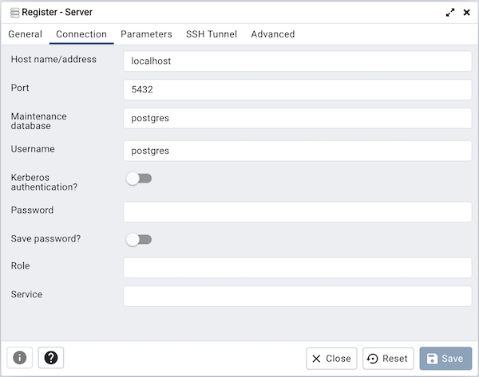

Installation and configuration instruction
==========================================

Installing PostgreSQL and pgAdmin 4
-----------------------------------

To install the packages it is necessary to execute the installation script:

```
$ sudo ./script.sh
```

Setting
-------

1.- Login postgres as superuser

```
$ sudo su - postgres
```

2.- Start the postgresql command line to create username and password

```
$ psql
```  
```
$ create user username with password 'your_password';
```

3.- Instruction to create a database

```
$ create database my_database with owner username;
```

4.- Assign super user privileges to the previously created user

```
$ alter user username with superuser;
```

Server connection
-----------------

To configure a server it is necessary to enter the Postgresql graphical interface called pgAdmin. Its graphical interface supports all the features of PostgreSQL and greatly facilitates administration since it allows us to do SQL searches to develop our entire database in a very easy and intuitive way: directly from the graphical interface.


*   Step 1: login to pgAdmin to start you must enter a master password:
    
    
*   Step 2: once inside pgAdmin in the panel we select add new server:
    
    
*   Step 3: in the general tab we place the name of the server, it can be the name of your preference:
    
    
*   Step 4: in the connection tab, we set the server IP, followed by the name of the database, username and password:
    
    
*   Step 5: to finish save all the changes made by pressing the save button located at the bottom right.

